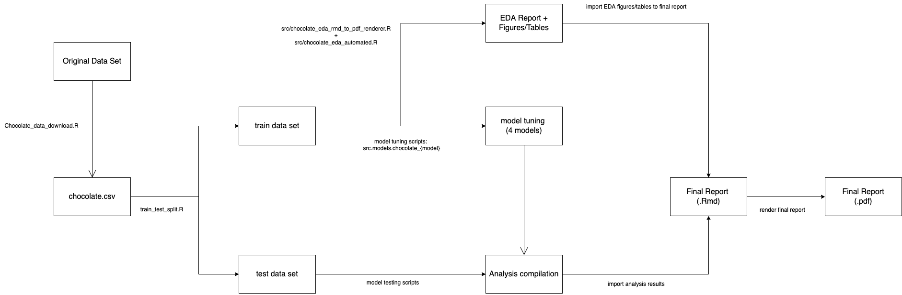

# Chocolate Exploration

> Authors: Manvir Kohli, Julie Song, Kelvin Wong
>
> Project complete in accordance with DSCI 522 for the UBC MDS Program 2022-23 for Group 15

## About

"Given the characteristics of a new dark chocolate, what will be its predicted rating on a scale of 1 to 5?" This is the predictive research question that we have set out to answer. Using this information, perhaps we can predict how well-received a new dark chocolate product may be.

Four regression models were built to answer this question: k-nearest neighbors, RIDGE (linear regression), support vector machines with a radial basis function kernel, and a decision tree. All four models were compared using mean absolute percentage error, and performed fairly well on the test data set. The worst model was the decision tree with 11% error, while the best model was the SVM RBF model with 8.6% error. Although the errors are quite small, because the rating scale only extends from 1 to 5, it would be best to minimize this error as much as possible. Thus, improvements to the model are recommended before it may be put to practical use.

The data set is from [Flavors of Cacao](http://flavorsofcacao.com/chocolate_database.html), where the Manhattan Chocolate Society (headed by Brady Brelinski) has reviewed 2,500+ bars of craft chocolate since 2006. The findings have been compiled into a copy-paste-able table that lists each bar's manufacturer, bean origin, percent cocoa, ingredients, review notes, and numerical rating. The data set we are using is dated 2022-01-12.

A copy of the file can be found from [TidyTuesday project from the R4DS Community](https://github.com/rfordatascience/tidytuesday) using the following raw URL:

    https://github.com/rfordatascience/tidytuesday/raw/master/data/2022/2022-01-18/chocolate.csv

It can also be downloaded using the instructions below.

## Report

The final report can be found [here](doc/chocolate_exploration_results_report.pdf). 

## Usage

If you are interested in just running the exploration project, you can use [Docker](https://www.docker.com/) or [Podman](https://podman.io), by downloading from the Docker Hub:

```bash
# WIP here
# TODO: implement me!
```

You may refer to the [`Dockerfile`](./Dockerfile) for more information.

## Usage (Advanced)

Alternatively, if you are interested in contributing, hacking, or simply running locally without using VMs, make sure your computer has R _and_ Python development environment set up. IDEs like [R Studio](https://posit.co/products/open-source/rstudio/) and [Visual Studio Code](https://code.visualstudio.com/) are optional but recommended.

It is highly recommended to have GNU toolchain configured and set up, in particular [GNU Make](https://www.gnu.org/software/make/).

The following flowchart gives an overview for the script workflow:



### Download the code

The latest copy of this code can be downloaded by:

```bash
git clone https://github.com/UBC-MDS/chocolate_exploration.git
cd chocolate_exploration
```

### Install the dependencies

The EDA and report texts are written in R, and the packages can be installed by:

```bash
R -e 'install.packages("docopt")' && Rscript deps.R --install
```

The versions used in the development can be confirmed by:

```bash
Rscript deps.R --list
```

Which should show:

```
caTools==1.18.2
cowplot==1.1.1
docopt==0.7.1
dplyr==1.0.10
kableExtra==1.3.4
knitr==1.41
magick==2.7.3
rmarkdown==2.18
tidyverse==1.3.2
webshot==0.5.4
```

Also, you should make sure your environment has `pandoc` and `pandoc-citeproc` installed. Please consult [the Pandoc documentation](https://pandoc.org/installing.html) for more details.

The actual analyses are written in Python. A [Conda](https://conda.io/) environment file can be found at [`environment.yml`](./environment.yaml).

To create the environment, run this at the project root:

```bash
conda env create -f environment.yaml
```

To activate the environment:

```bash
conda activate chocolate_exploration
```

To deactivate the environment:

```bash
conda deactivate
```

For more information, please refer to the [Conda documentation](https://conda.io/projects/conda/en/latest/user-guide/tasks/manage-environments.html).

**Note**: the following `make` commands assume you are already in a Python environment where the libraries are installed. Before continuing, make sure you have activated the `chocolate_exploration` environment.

### Running/cleaning all files
To render the full analysis in one step, including downloading and splitting the raw data, running the EDA analysis, tuning the models, and rendering the final report, the following command can be run from the root directory:
```bash
make all
```
Note that it may take a long period of time (~30 mins) for all of the models to run. 

Please also note that the `make eda` and `make report` steps may encounter issues with the `pandoc` package in Jupyter Lab. For example, using `make all` will successfully run `make dataset` but encounter the `pandoc` error with `make eda`. Please run `make eda` separately in R Studio, and then run `make all` again in Jupyter lab, which will run all of the successive scripts. If the error is encountered again in the final step, `make report`, please run `make report` in R Studio.

To reset the repository and clean all of the intermediate and results files, the following command can be run from the root directory:
```bash
make clean
```

### Download and split the data set

Aside from the raw URL mentioned above, you may run the following at the project root to download and split the raw dataset:

```bash
make dataset
```

Under the hood, it uses [`src/chocolate_data_download.R`](./src/chocolate_data_download.R) to download the dataset, and uses [`src/train_test_split.R`](./src/train_test_split.R) to process the `chocolate.csv` into a `train_df.csv` and a `test_df.csv` using a 70%-30% split.


### EDA Analysis

You can run the EDA of this dataset using the [`src/chocolate_eda_automated.R`](./src/chocolate_eda_automated.R) script in the [`src`](./src) folder. Running the command below saves the results of EDA in the [`src/eda_files`](./src/eda_files) folder.

```bash
make eda
```

The scripts generate these files:
- A complete summary in PDF, [`chocolate_eda.pdf`](src/eda_files/chocolate_eda.pdf)
- Summary of null values in HTML, [`1.Nulls_table.html`](src/eda_files/1.Nulls_table.html)
- Summary of final features used for modelling, [`2.Final_Features_Table.html`](./src/eda_files/2.Final_Features_Table.html)
- View of the final dataset, [`3.Final_Dataset_View.html`](./src/eda_files/3.Final_Dataset_View.html)
- Plots for numerical variables, [`Numerical_Plots.png`](./src/eda_files/Numeric_Plots.png)
- Plots for categorical variables, [`Categorical_Plots.png`](./src/eda_files/Categorical_Plots.png)

Under the hood the generation scripts are [`src/chocolate_eda_automated.R`](./src/chocolate_eda_automated.R) and [`src/chocolate_ed_rmd_to_pdf_renderer.R`](./src/chocolate_ed_rmd_to_pdf_renderer.R).

### Tune the models

To tune the models, run the following command at the project root:

```bash
make model
```

This command generates `tuned_{model_name}.joblib` under the folder [`results/models/`](./results/models/) and `cv_results_{model_name}.csv` under the folder [`results/cv_scores`](./results/cv_scores).

The scripts of the model tuning can be found in the [`src/models`](./src/models/) folder.

### Check model performance on test data

To score the model on test data, run the following commands at the project root:

```bash
make performance
```

The command does the following:
- aggregates and exports the mean of cross validation results as a csv file as `results/cv_scores_summary.csv`;
- scores all the models' performance on the test data; and
- exports the scores for all the models as a csv file at [`results/test_data_results.csv`](./results/test_data_results.csv)

### Get the final report as PDF

The final report of the analysis is already included as a PDF, as mentioned above. However in case it is not available, you can run the below command to generate a PDF report under [`doc/chocolate_exploration_results_report.pdf`](doc/chocolate_exploration_results_report.pdf):

```bash
make report
```

The generation script can be found in [`doc/chocolate_exploration_results_pdf_renderer.R`](doc/chocolate_exploration_results_pdf_renderer.R).

## Copyright and Licensing

The CSV files under `data/raw/` directories are works/direct derivative of works from the [Chocolate Bar Ratings database](http://flavorsofcacao.com/chocolate_database.html).

Copyright (c) 2011-2022 Brady Brelinski

Unless otherwise specified, the materials in this repository are covered under this copyright statement:

Copyright (c) 2022 Manvir Kohli, Julie Song, Kelvin Wong

The software and associated documentation files are licensed under the MIT License. You may find a copy of the license at [`LICENSE.md`](./LICENSE.md).

The report texts are licensed under the Creative Commons Attribution-NonCommercial-NoDerivatives 4.0 (CC BY-NC-ND 4.0) License. A copy of the license can be found at [`LICENSE-CC-BYNCND.md`](./LICENSE-CC-BYNCND.md).

## References

The Manhattan Chocolate Society, 2022, "Chocolate Bar Ratings", Flavors of Cocoa [Online]. Available: <http://flavorsofcacao.com/chocolate_database.html>

Thomas Mock (2022). Tidy Tuesday: A weekly data project aimed at the R ecosystem. <https://github.com/rfordatascience/tidytuesday>. 
