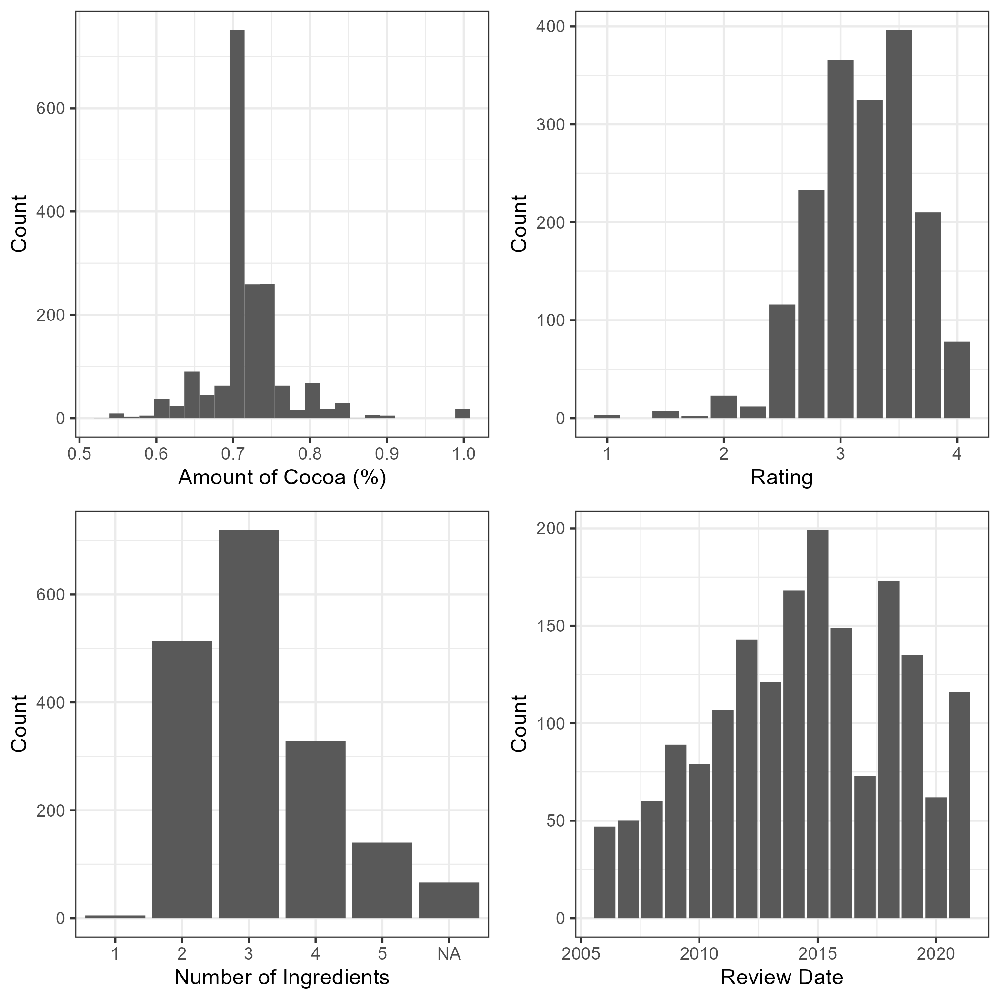
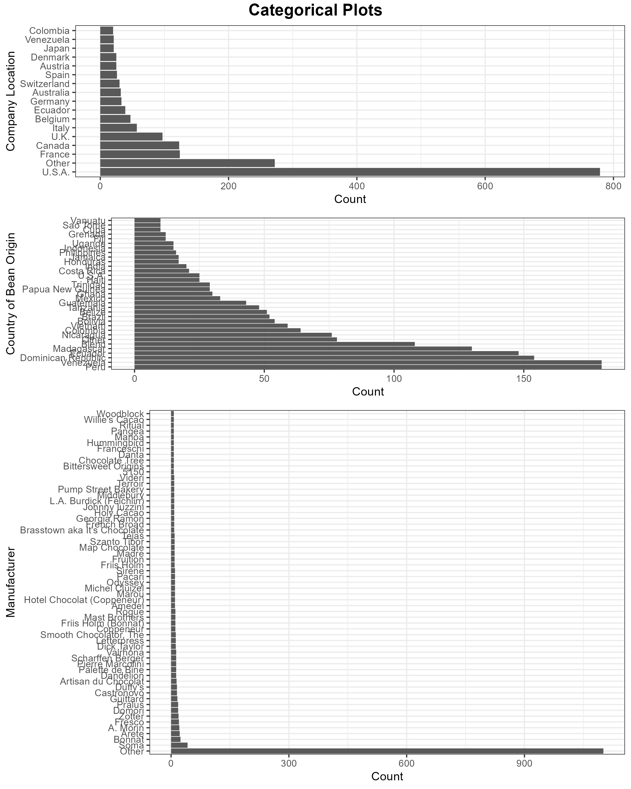

```{r setup, include=FALSE}
knitr::opts_chunk$set(echo = TRUE)
```

```{r libraries, echo=FALSE, message=FALSE}
library(dplyr)
library(tidyverse)
library(cowplot)
library(knitr)
library(kableExtra)
```

# Summary

Four regression models were built using decision tree, support vector machine, ridge (linear regression) and k-nearest neighbors algorithms, and compared to determine the best model for predicting a chocolate's rating based on characteristics such as the number and type of ingredients in the chocolate, its amount of cocoa, location for the manufacturing company, memorable characteristics, and several others. The ratings are predicted based on a scale of 1 to 5. Our models performed well on a test set containing 759 observations, with most models having MAPE values of less than 10%.

# Introduction

Commonly known as the "Food of the Gods", chocolate is a treat that is a world-wide favorite among the people. A recent study on food consumption changes during the COVID-19 pandemic and subsequent lockdown periods in Denmark, Slovania, and Germany revealed an increase in people consuming frozen and canned products, but also an increase in sweets, including chocolate (@choco_pand). In particular, dark chocolate has been gaining attention due to the many health benefits that it provides (@health, @morehealth).

There is interest in exploring this growing market of dark chocolate production, but there are a number of factors to consider about the chocolate itself. For example, dark chocolate is characterized by its large percentage of cocoa solids, which can vary between 50%-90% and gives it its signature bitter taste (@darkchoco). The project presented here is interested in predicting the rating for a type of dark chocolate on a scale of 1 to 5, given some of its characteristics, including its ingredients, amount of cocoa solids, manufacturing location, and more. This information can be useful for product analysis, and may be able to aid in predicting the popularity of a new product. 

Our target mean absolute percent error (MAPE) is 5% for the predicted ratings. We chose MAPE because our rating scale is not very large and does not have units, so a relative percentage error is easier to understand for this context.

# Methods

## Data

The data set is provided by the [Manhattan Chocolate Society (\@cocoa)](http://flavorsofcacao.com/chocolate_database.html), and was found and retrieved from the [tidytuesday data project (\@tidytuesday)](https://github.com/rfordatascience/tidytuesday), specifically through this link: <https://github.com/rfordatascience/tidytuesday/blob/master/data/2022/2022-01-18/readme.md>

The data set contains observations for different types of dark chocolate, including the manufacturing company and its location, the origin of the cocoa beans used to make the chocolate, the other ingredients in the chocolate, the amount of cocoa in the chocolate, and others. They have also provided a feature column that contains descriptive words relating to the characteristics of the chocolate flavor, and a final rating.

Before the models were built, the data also had to be processed. The information in the `ingredients` feature column was split apart into several columns, including one column for the number of ingredients in the chocolate, and one column for each of the recorded ingredients. The company location and cocoa bean origin features were modified such that only some categories that had total observations meeting a minimum threshold were considered, while the remaining categories were considered "Other". The feature for the amount of cocoa in the chocolate was also converted from a character datatype to a numerical datatype.

## Analysis

Four regression models were built after splitting the original data set into training and testing data sets in a 70%-30% split. Apart from the processing performed above, some features were also dropped due to being practically unique to each observation, such as the reference number and the company manufacturer. Table 1 shows the hyperparameters that were considered for each regression model. Hyperparameter optimization was performed for each model, using 20 iterations of 5-fold cross-validation each.

```{r hyperparamter table, echo=FALSE, message=FALSE}
hparams <- tibble(Model = c("KNN", "KNN", "KNN", "KNN",
                            "Ridge", "Ridge", 
                            "SVM RBF", "SVM RBF", "SVM RBF", 
                            "Decision Tree", "Decision Tree",
                            "Random Forest", "Random Forest", "Random Forest"
                            ),
                  Hyperparameter = c(
                    "Max Text Features", "Leaf Size", "Number of Neighbors", "Weights",
                    "Max Text Features", "Alpha",
                    "Max Text Features", "C", "Gamma",
                    "Max Text Features", "Max Depth",
                    "Max Text Features", "Max Depth", "Number of Estimators"
                    ))

collapse_rows(kable(hparams, format="latex", booktabs=TRUE,
      caption = "Model Hyperparameters")) |>
  kable_styling(latex_options=c("HOLD_position"),
                font_size = 10)

```

The initial exploratory data analysis for this dataset was performed in R (@R) using the following packages: dplyr (@dplyr), tidyverse (@tidy), docopt (@docoptR), cowplot (@cow), knitr (@knitr), and kableExtra (@kableEx).

The modelling was performed in Python (@Python) using the following packages, available in the provided environment file: matplotlib (@Hunter:2007), scikit-learn (@scikit-learn), pandas (@mckinney), imbalanced-learn (@imbalanced), lightgbm (@lightgbm), joblib (@joblib), docopt (@docoptpython), and dill (@dill).

## Results and Discussions

The distributions for the numerical and categorical features were first analyzed to check for any unreasonable skewness. These distributions are presented in Figures 1 and 2. The top company locations which had at least 20 observations and the top bean origin countries with at least 10 observations were kept, while the remaining categories in each feature were grouped as Other. It is revealed that the manufacturing company feature has an overwhelming number of categories, and even taking into considering only the top 50 companies, the Other category has far more points compared to the others. This feature was considered too unique to the observations, and was omitted from the modelling.

{width="60%," height="60%"}

{width="80%," height="80%"}


Table 2 shows the optimal hyperparameters, their associated values, and the resulting validation scores for each model. The scoring metric was chosen to be based on the mean absolute percentage error. It can be seen that the KNN model may be overfitting, since its training score is 0 (i.e. a perfect model), while its validation score indicates 10.6% error.

```{r optimized hyperparamter table, echo=FALSE, message=FALSE}
knn_cv <- read_csv("../results/cv_scores/cv_results_knn.csv")
ridge_cv <- read_csv("../results/cv_scores/cv_results_ridge.csv")
svmrbf_cv <- read_csv("../results/cv_scores/cv_results_svm_rbf.csv")
dt_cv <- read_csv("../results/cv_scores/cv_results_decision_tree.csv")
rf_cv <- read_csv("../results/cv_scores/cv_results_random_forest.csv")

opt_params <- tibble(Model = c("KNN", "KNN","KNN", "KNN", 
                               "Ridge", "Ridge", 
                               "SVM RBF", "SVM RBF", "SVM RBF",
                               "Decision Tree", "Decision Tree",
                               "Random Forest", "Random Forest", "Random Forest"
                               ),
                  Hyperparameter = c(
                    "Max Text Features", "Leaf Size", "Number of Neighbors", "Weights",
                    "Max Text Features", "Alpha", 
                    "Max Text Features", "C", "Gamma", 
                    "Max Text Features", "Max Depth",
                    "Max Text Features", "Max Depth", "Number of Estimators"
                    ),
                  "Optimized Value" = c(395, 450, 13, "Distance", 
                                        437, 1,
                                        262, 39.5, 1.4e-03,
                                        176, 9,
                                        396, 78, 351
                                        ),
                  "Mean Validation MAPE (%)" = c(11.0, 11.0, 11.0, 11.0,
                                         9.1, 9.1,
                                         9.0, 9.0, 9.0,
                                         10.9, 10.9,
                                         9.5, 9.5, 9.5
                                         ), 
                  "Mean Training MAPE (%)" = c(0, 0, 0, 0,
                                       6.7, 6.7,
                                       6.8, 6.8, 6.8,
                                       8.6, 8.6,
                                       3.4, 3.4, 3.4
                                       ))

collapse_rows(kable(opt_params, format="latex", booktabs=TRUE,
      caption = "Optimized Hyperparameters With MAPE Values")) |>
  kable_styling(latex_options=c("HOLD_position"),
                font_size = 10)
```

The models performed well on the test data sets, with similar results compared to the validation scores, as shown in Table 3. The best-performing model was the SVM RBF model, as it only has an average of 8.6% error for its ratings, while the worst-performing model was the decision tree model, with an average of 11% error. Our best model was close to our target MAPE of 5%, although its error is still a bit high. Although this is not extremely different, since our rating scale is quite small, we would still prefer to decrease the error if possible.

```{r tests table, echo=FALSE, message=FALSE}

test_results <- read_csv("../results/test_data_results.csv") |>
  rename(Model= ...1) |>
  mutate(Model = replace(Model, Model == "Decision_Tree", "Decision Tree")) |>
  mutate(`MAPE (%)` = round(`MAPE (%)`, 1))

order_m <- c("KNN", "Ridge", "SVM RBF", "Decision Tree") 

test_results <- test_results |>
  slice(match(order_m, Model))
kable(test_results, format="latex", booktabs=TRUE,
      col.names = c("Model", "Test MAPE (%)"),
      caption = "Test Results for Each Model") |>
  kable_styling(latex_options=c("HOLD_position"),
                font_size = 10)


```

There are several areas for improvement with these models. For instance, perhaps we could do some feature engineering by using a sentiment analysis package on the memorable characteristics text feature, and manually aggregate some of the similar terminology (such as "acidic" and "acid"). Since most of our features are categorical features, we could also do some feature crosses and determine if there are any relations between the features. This might require some more careful examination of the data, but for instance, we could begin with some crosses of the ingredients present in the chocolate. As well, we could introduce a noise attribute for regularization, as it may help us identify exactly how well the model is actually performing with these features. Finally, we may also do some feature selection based on coefficient weightings, for instance for the Ridge model. Perhaps these can allow us to make the models more generalizable, and better able to predict well for brand-new types of chocolate, which is the ultimate goal for the project.

# References
