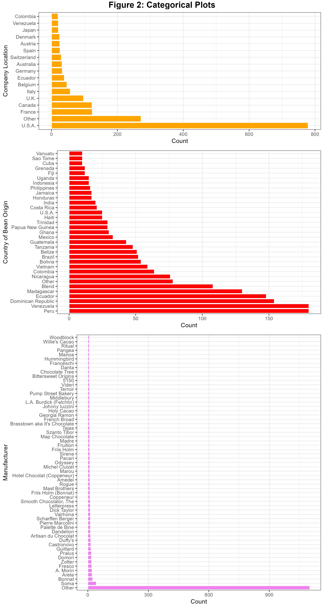
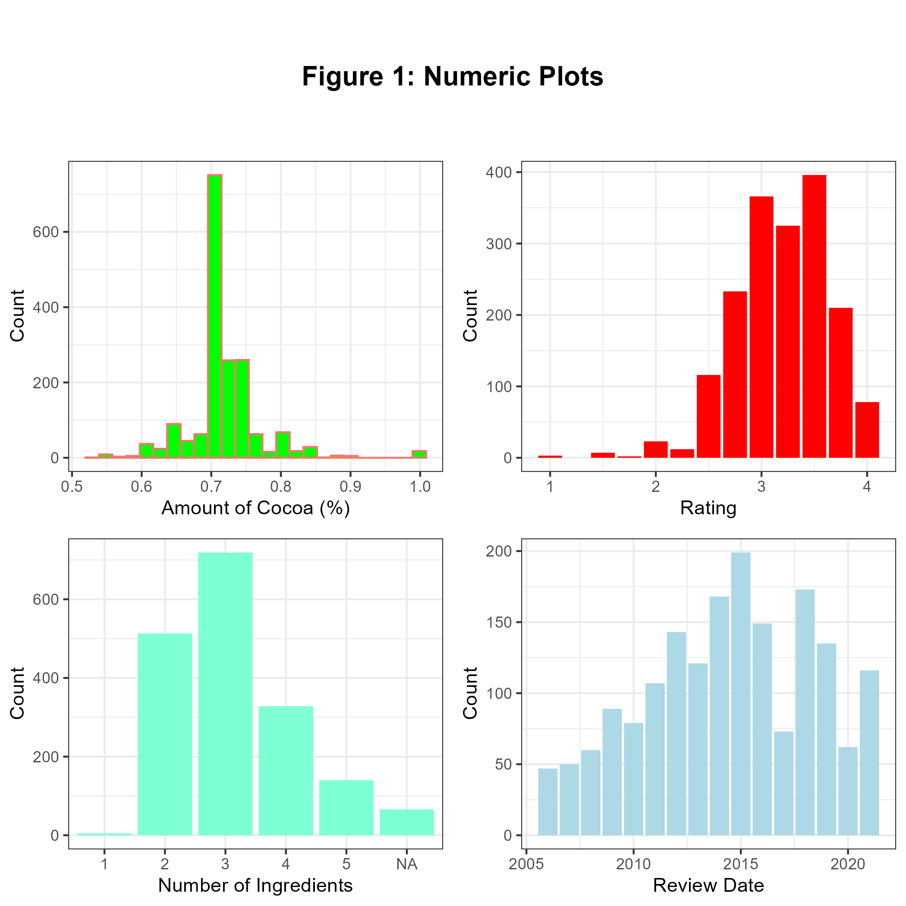

```{r setup, include=FALSE}
knitr::opts_chunk$set(echo = TRUE)
```

```{r libraries, echo=FALSE, message=FALSE}
library(dplyr)
library(tidyverse)
library(cowplot)
library(knitr)
library(kableExtra)
library(pandoc)
```

# Summary

Four regression models were built using decision tree, support vector machine, ridge (linear regression) and k-nearest neighbors algorithms, and compared to determine the best model for predicting a chocolate's rating based on characteristics such as the number and type of ingredients in the chocolate, its amount of cocoa, location for the manufacturing company, memorable characteristics, and several others. The ratings are predicted based on a scale of 1 to 5. Our models performed \_\_\_ on a test set containing \_\_\_\_ observations...

# Introduction
Chocolate is one of the most well-known foods in the world. Out of all the different types of chocolates, dark chocolate contains the most cocoa solids and is the closest to the original that was deemed the "Food of the Gods" by the Mayans thousands of years ago (@darkchoco). Indeed, dark chocolate has garnered more interest in recent years due to the many health benefits that it provides (@health).

Nevertheless, popularity can vary between products, How well-recieved a new chocolate may be, can depend on a variety of factors. The project present here is interested in predicting the rating for a type of dark chocolate on a scale of 1 to 5, given some of its characteristics. This information can be useful for product analysis, and may be able to aide in predicting the popularity of a new product. It may also be useful for determining some important factors in the development of the chocolate, and suggest characteristics to focus on in order to develop a successful product.

# Methods

## Data

The data set is provided by the [Manhattan Chocolate Society (\@cocoa)](http://flavorsofcacao.com/chocolate_database.html), and was found and retrieved from the [tidytuesday data project (\@tidytuesday)](https://github.com/rfordatascience/tidytuesday), specifically through this link: <https://github.com/rfordatascience/tidytuesday/blob/master/data/2022/2022-01-18/readme.md>

The data set contains observations for different types of dark chocolate, including the manufacturing company and its location, origin of the cocoa beans used to make the chocolate, the other ingredients in the chocolate, the amount of cocoa in the chocolate, and others. They have also provided a feature column that contains descriptive words relating to the characteristics of the chocolate flavor, and a final rating.

Before the models were built, the data also had to be processed. The information in the `ingredients` feature column was split apart into several columns, including one column for the number of ingredients in the chocolate, and one column for each of the recorded ingredients. The company location and cocoa bean origin features were modified such that only some categories that had total observations meeting a minimum threshold were considered, while the remaining categories were considered "Other". The amount of cocoa in the chocolate feature was also converted from a character data type to a numerical datatype.

## Analysis

Four regression models were built after splitting the original dataset into training and testing dataset in a 70%-30% split. Apart from the processing performed above, some features were also dropped due to being practically unique to each observations, such as the reference number and the company manufacturer. Table 1 shows the hyperparameters that were considered for each regression model. Hyperparameter optimization was performed for each model, using 20 iterations of 5-fold cross-validation each.

```{r hyperparamter table, echo=FALSE, message=FALSE}
hparams <- tibble(Model = c("KNN","KNN", "KNN", "Ridge", "SVM RBF", "SVM RBF", "Decision Tree"),
                  Hyperparameter = c("Leaf Size", "Number of Neighbors", "Weights",
                                     "Alpha", "C", "Gamma", "Max Depth"))

collapse_rows(kable(hparams, format="latex", booktabs=TRUE,
      caption = "Model Hyperparameters")) |>
  kable_styling(latex_options=c("HOLD_position"),
                font_size = 10)

```

The initial exploratory data analysis for this dataset was performed in R (@R) using the following packages: dplyr (@dplyr), tidyverse (@tidy), docopt (@docoptR), cowplot (@cow), knitr (@knitr), and kableExtra (@kableEx).

The modelling was performed in Python (@Python) using the following packages, available in the provided environment file: matplotlib (@Hunter:2007), scikit-learn (@scikit-learn), pandas (@mckinney), imbalanced-learn (@imbalanced), lightgbm (@lightgbm), joblib (@joblib), docopt (@docoptpython), and dill (@dill).

## Results and Discussions

The distributions for the numerical and categorical features were first analyzed to check for any unreasonable skewness. These distributions are present in Figures 1 and 2. The top company locations which had at least 20 observations and the top bean origin countries with at least 10 observations were kept, while the remaining categories in each feature were grouped as Other. It is revealed that the manufacturing company feature has an overwhelming number of categories, and even taking into considering only the top 50 companies, the Other category has far more points compared to the others. This feature was considered too unique to the observations, and was omitted from the modelling.

{width=70%, height=70%}

{width=50%, height=50%}

Table 2 shows the optimal hyperparameters, their associated values, and the resulting validation scores for each model. The hyperparameter optimization and cross-validation was performed for each of the models in this regression problem. <comment about how well/not well the models performed>

```{r optimized hyperparamter table, echo=FALSE, message=FALSE}
opt_params <- tibble(Model = c("KNN","KNN", "KNN", "Ridge", "SVM RBF", "SVM RBF", "Decision Tree"),
                  Hyperparameter = c("Leaf Size", "Number of Neighbors", "Weights",
                                     "Alpha", "C", "Gamma", "Max Depth"),
                  "Optimized Value" = c(1, 2, 3, 4, 5, 6, 7))

collapse_rows(kable(opt_params, format="latex", booktabs=TRUE,
      caption = "Optimized Hyperparameters With Validation Scores")) |>
  kable_styling(latex_options=c("HOLD_position"),
                font_size = 10)
```

The models performed \_\_\_\_\_ on the test datasets (how they compare with the validation results, how they compare with each other, were they accurate) Table 3 shows a comparison of scores for the models. The scoring metric used was the negative mean absolute percentage error metric, hence the scores are negative. Looking only at their magnitudes, \_\_\_\_model had the smallest error (so was the best model, \_\_\_% difference compared to the actual rating)

There are several areas for improvement with these models. For instance, perhaps we could use a sentiment analysis package on the memorable characteristics text feature, and manually aggregate some of the similar terminology (such as "acidic" and "acid"). Since most of our features are categorical features, we could also do some feature crosses and determine if there are any relations between the features. This might require some more careful examination of the data, but for instance, we could begin with some crosses of the ingredients present in the chocolate. As well, we could introduce a noise attribute for regularization, as it may help us identify exactly how well the model is actually performing with these features. Finally, we may also do some feature selection based on coefficient weightings, for instance for the Ridge model. Perhaps these can allow us to make the models more generalizable, and able to predict well for brand-new types of chocolate, which is the ultimate goal for the project.

# References
